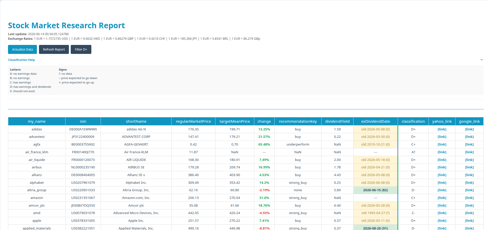

# Stock Market Research

This tool provides an automated research report on stock market data using `yfinance`. It is designed as a professional data pipeline with a web-based dashboard.

## Features

- **Automated Data Pipeline:** Downloads and processes stock data, handles currency conversion (to EUR), and generates custom classifications.
- **Privacy First:** Supports a dual-data structure. Prioritizes `my_data/` for personal use while falling back to `data/` for public samples.
- **Interactive Dashboard:** Web interface with client-side sorting and one-click data actualization. Available as a **Flask** server (`web_gui/`) or a **FastAPI** server (`web_gui_fa/`).
- **Testing Suite:** Robust unit testing using `pytest` and `mocker` to ensure data integrity.
- **Logging:** Professional logging system for monitoring the data pipeline execution.



## Installation

1. Create and activate a virtual environment:
   ```bash
   python3 -m venv venv
   source venv/bin/activate
   ```

2. Install the project in editable mode:
   ```bash
   pip install -e .
   ```

## How to use

### 1. Web Dashboard (Recommended)

Two server implementations are available, both running on `http://localhost:5000`.

#### Flask server (original)

```bash
python web_gui/server.py
```

#### FastAPI server

```bash
python web_gui_fa/server.py
```

The FastAPI server also exposes interactive API docs at `http://localhost:5000/docs`.

- **View Report:** Open `http://localhost:5000` in your browser.
- **Actions:** Use the buttons in the header to **Actualize Data**, **Refresh** the report, or **Filter** for high-quality (D+) stocks.

### 2. Generate Report (CLI)

You can run the pipeline directly from the terminal:

```bash
# Basic report using default data
python data_pipeline/create_report.py

# Report with data actualization (downloads new data)
python data_pipeline/create_report.py -a
```

### 3. Running Tests

To verify the logic and data integrity:

```bash
pytest tests/
```

## Project Structure

- `data_pipeline/`: Core logic for data processing and report generation.
- `web_gui/`: Flask web application and dashboard server.
- `web_gui_fa/`: FastAPI web application and dashboard server.
- `configuration.py`: Centralized management of paths, currencies, and report columns.
- `utils/`: Reusable utilities for stock data retrieval.
- `data/`: Sample stock lists for demonstration.
- `my_data/`: (Ignored by git) Private directory for your personal stock lists.
- `reports/`: Location of generated HTML reports.
- `tests/`: Automated test suite.
